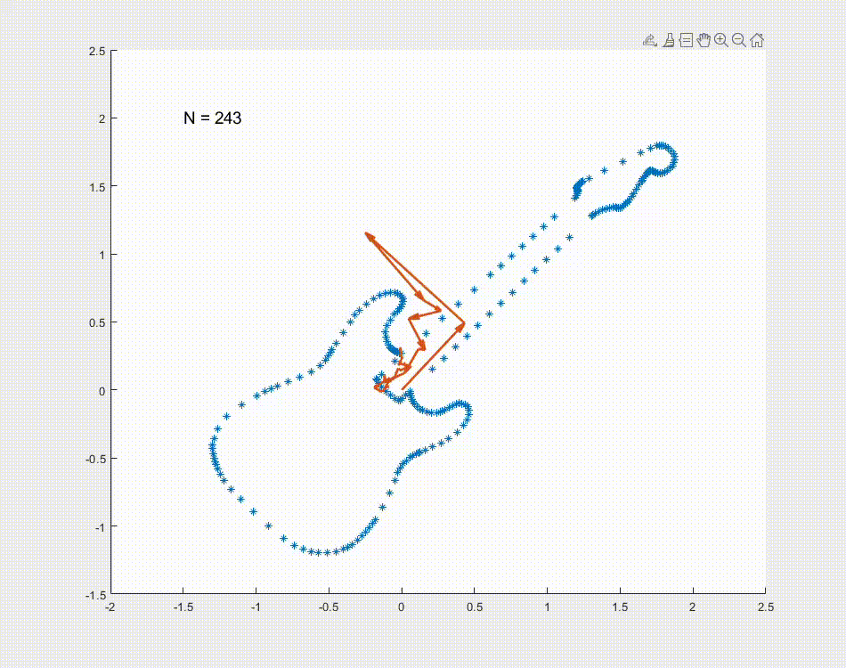

# Fourier Plotter

<!-- TABLE OF CONTENTS -->

  
Table of Contents

  <ol>
    <li>
      <a href="#about-the-project">About The Project</a>
    </li>
    <li>
      <a href="#getting-started">Getting Started</a>
    </li>
  </ol>

<!-- ABOUT THE PROJECT -->
## About The Project
How to use the Fourier series to approximate an arbitrary 2D path by summing rotating vectors.\
The path to be approximated is described by a sequence of points loaded from a .svg file. Points are treated as complex numbers, where the real and imaginary components represent the x and y coordinates. By taking the Fourier series of the points the magnitude and initial phase for each vector can be determined. The approximated path is traced by adding all the vectors while they rotate at a constant angular velocity.

### Sequence of operations:
+ Load points from .svg file.
+ Compute Fourier series coefficients.
+ Reconstruct path by adding rotating vectors.

<!-- GETTING STARTED -->
## Getting Started
+ run `simulation.m`
